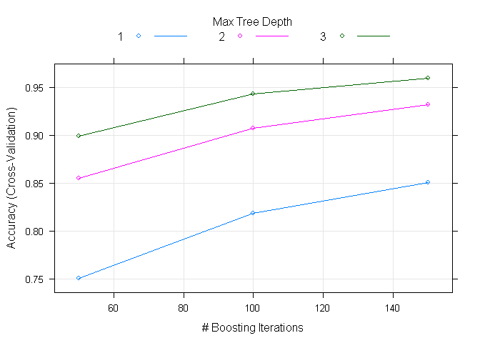
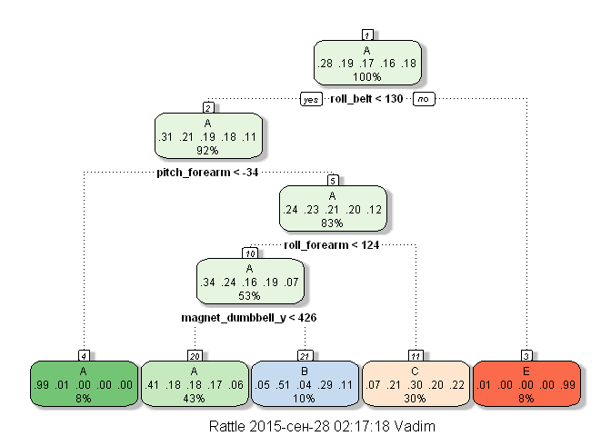
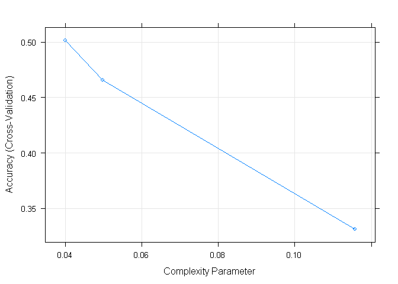

# Coursera Practical Machine Learning Project
Vadim Galenchik  
Saturday, Septenber 25, 2015  

##Background and Introduction

Using devices such as Jawbone Up, Nike FuelBand, and Fitbit is now possible to collect a large amount of data about personal activity relatively inexpensively. These type of devices are part of the quantified self movement – a group of enthusiasts who take measurements about themselves regularly to improve their health, to find patterns in their behavior, or because they are tech geeks. One thing that people regularly do is quantify how much of a particular activity they do, but they rarely quantify how well they do it.

In this project, we will be to use data from accelerometers on the belt, forearm, arm, and dumbell of 6 participant They were asked to perform barbell lifts correctly and incorrectly in 5 different ways. The five ways are exactly according to the specification (Class A), throwing the elbows to the front (Class B), lifting the dumbbell only halfway (Class C), lowering the dumbbell only halfway (Class D) and throwing the hips to the front (Class E). Only Class A corresponds to correct performance. The goal of this project is to predict the manner in which they did the exercise, i.e., Class A to E. More information is available from the website here: http://groupware.les.inf.puc-rio.br/har (see the section on the Weight Lifting Exercise Dataset).

The data for this project come from this source: http://groupware.les.inf.puc-rio.br/har. The results were published at
Velloso, E.; Bulling, A.; Gellersen, H.; Ugulino, W.; Fuks, H. Qualitative Activity Recognition of Weight Lifting Exercises. Proceedings of 4th International Conference in Cooperation with SIGCHI (Augmented Human '13) . Stuttgart, Germany: ACM SIGCHI, 2013.

Read more: http://groupware.les.inf.puc-rio.br/har#wle_paper_section#ixzz3my7131jX

##Data Processing

###Import the data

After loading of the R packages needed for analysis we download the training and testing data sets from the given URLs.


```r
setInternet2(TRUE)
download.file("https://d396qusza40orc.cloudfront.net/predmachlearn/pml-training.csv", destfile = "pml-training.csv")

download.file("https://d396qusza40orc.cloudfront.net/predmachlearn/pml-testing.csv", destfile = "pml-testing.csv")

validation <- read.csv("pml-testing.csv")
training <- read.csv("pml-training.csv")
```
###Find predictors

Remove near zero covariates

```r
# remove near zero covariates
nz <- nearZeroVar(training, saveMetrics = T)
training <- training[, !nz$nzv]
```

Remove variables with more than 80% missing values

```r
# remove variables with more than 80% missing values
check_missing <- function(x) sum(is.na(x) | x == "") > 0.8*nrow(training)
nav <- sapply(training, check_missing)
training <- training[, !nav]
```
Because of their nature variables "X" ,"user_name","raw_timestamp_part_1", 
"raw_timestamp_part_2",  "cvtd_timestamp", "num_window" cannnot be considered as predictors. So let's removw them.


```r
training <- training[, -c(1:6)]
```

###Model selection

First of all we should estimate if lenear models may be applied here or not. To do it we calculate correlations between each remaining feature to the response.


```r
# calculate correlations
cor_fn <- function(x) cor(x, as.numeric(training$classe))
cor_v <- abs(sapply(training[, -ncol(training)], cor_fn))
summary(cor_v)
```

```
##      Min.   1st Qu.    Median      Mean   3rd Qu.      Max. 
## 0.0009977 0.0131000 0.0454000 0.0798400 0.1204000 0.3438000
```

The results show that that the correlations are low.
Thus linear regression model is not suitable in this case. Boosting, classification trees and random forests algorithms are expected to generate more accurate predictions for the data. Unfortunatelly I have old PC and because of memory space issue I cannot run random forest algorithm on this dataset. :( Thus I will check boosting and classification tree.

To select the best algorithm let us split the data into test and train sets


```r
set.seed(as.numeric(as.Date("2015-09-25")))
in_train <- createDataPartition(training$classe, p=0.6)
trn <- training[in_train[[1]], ]
tst <- training[-in_train[[1]], ]

control <- trainControl(method = "cv", number = 5)
```

####Boosting

Create boosting model, predict outcomes using validation set, print prediction results, plot accuracy of this model.
 

```r
fit_boost <- train(classe ~ ., method = "gbm", data = trn, 
                  verbose = FALSE, 
                  trControl = control)

# predict outcomes using validation set
predict_boost <- predict(fit_boost, tst)
# Show prediction results
conf_boost <- confusionMatrix(tst$classe, predict_boost)
print(conf_boost)
```

```
## Confusion Matrix and Statistics
## 
##           Reference
## Prediction    A    B    C    D    E
##          A 2197   24    8    1    2
##          B   48 1422   41    6    1
##          C    1   39 1305   21    2
##          D    0    6   60 1205   15
##          E    3   10   15   15 1399
## 
## Overall Statistics
##                                           
##                Accuracy : 0.9595          
##                  95% CI : (0.9549, 0.9637)
##     No Information Rate : 0.2866          
##     P-Value [Acc > NIR] : < 2.2e-16       
##                                           
##                   Kappa : 0.9487          
##  Mcnemar's Test P-Value : 1.92e-07        
## 
## Statistics by Class:
## 
##                      Class: A Class: B Class: C Class: D Class: E
## Sensitivity            0.9769   0.9474   0.9132   0.9655   0.9859
## Specificity            0.9937   0.9849   0.9902   0.9877   0.9933
## Pos Pred Value         0.9843   0.9368   0.9539   0.9370   0.9702
## Neg Pred Value         0.9907   0.9875   0.9809   0.9934   0.9969
## Prevalence             0.2866   0.1913   0.1821   0.1591   0.1809
## Detection Rate         0.2800   0.1812   0.1663   0.1536   0.1783
## Detection Prevalence   0.2845   0.1935   0.1744   0.1639   0.1838
## Balanced Accuracy      0.9853   0.9661   0.9517   0.9766   0.9896
```

```r
plot(fit_boost)
```

 

Thus the accuracy is about 95%. Sounds good. Let us look at classification tree.

####Classification tree
 
Create classification tree model, predict outcomes using validation set, print prediction results, draw tree and plot the accuracy.


```r
fit_rpart <- train(classe ~ ., data = trn, method = "rpart", 
                   trControl = control)
fancyRpartPlot(fit_rpart$finalModel)
```

 

```r
# predict outcomes using validation set
predict_rpart <- predict(fit_rpart, tst)
# Show prediction result
conf_rpart <- confusionMatrix(tst$classe, predict_rpart)
print(conf_rpart)
```

```
## Confusion Matrix and Statistics
## 
##           Reference
## Prediction    A    B    C    D    E
##          A 2005   54  164    0    9
##          B  616  401  501    0    0
##          C  641   27  700    0    0
##          D  565  224  497    0    0
##          E  207  109  475    0  651
## 
## Overall Statistics
##                                         
##                Accuracy : 0.4788        
##                  95% CI : (0.4677, 0.49)
##     No Information Rate : 0.5141        
##     P-Value [Acc > NIR] : 1             
##                                         
##                   Kappa : 0.3199        
##  Mcnemar's Test P-Value : NA            
## 
## Statistics by Class:
## 
##                      Class: A Class: B Class: C Class: D Class: E
## Sensitivity            0.4970  0.49202  0.29953       NA  0.98636
## Specificity            0.9405  0.84113  0.87874   0.8361  0.88992
## Pos Pred Value         0.8983  0.26416  0.51170       NA  0.45146
## Neg Pred Value         0.6386  0.93458  0.74730       NA  0.99859
## Prevalence             0.5141  0.10387  0.29786   0.0000  0.08412
## Detection Rate         0.2555  0.05111  0.08922   0.0000  0.08297
## Detection Prevalence   0.2845  0.19347  0.17436   0.1639  0.18379
## Balanced Accuracy      0.7187  0.66658  0.58914       NA  0.93814
```

```r
plot(fit_rpart)
```

 

From the confusion matrix, we can conclude that using classification tree does not predict the outcome very well.

##Final model and prediction

Comparing model accuracy of the two models generated, classification tree and boosting, the last model has overall better accuracy. So, this model is used for prediction.

Do the prediction ...


```r
# prediction
prediction <- as.character(predict(fit_boost, validation))
print(prediction)
```

```
##  [1] "B" "A" "B" "A" "A" "E" "D" "B" "A" "A" "B" "C" "B" "A" "E" "E" "A"
## [18] "B" "B" "B"
```

... and generate output results for automatic grading script.


```r
# write prediction files
pml_write_files = function(x){
  n = length(x)
  for(i in 1:n){
    filename = paste0("./prediction/problem_id_", i, ".txt")
    write.table(x[i], file = filename, quote = FALSE, row.names = FALSE, col.names = FALSE)
  }
}
pml_write_files(prediction)
```
